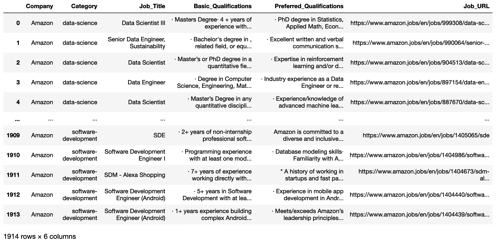

# Top-Skills-Employers-Look-For

Ever wondering what skill sets your dream job requires?

This repo contains [Dash](https://dash.plotly.com/) web application for top skill sets preferred by given company and job title. Here is the website for the application: [http://top-skills-dev.us-east-1.elasticbeanstalk.com/](http://top-skills-dev.us-east-1.elasticbeanstalk.com/). 

# Example

Below is an example of wordcould output when the selected company and job title is `Amazon` and `business-intelligence`Top skills include Python, SQL, Tableau, data warehousing and data modeling. 

# Dataset

Currently, `Amazon` is the only company studied. The dataset is crawled from [Amazon.jobs](https://www.amazon.jobs/en/). Revelant code can be found on [`crawl_data.py`](./crawl_data.py). Basic and preferred job qualifications are collected and combined into the table [`Amazon_Total_Qualifications.txt`](./data/Amazon_Total_Qualifications.txt) and the preview is shown below. In total, there are 1914 rows and more data can be crawled with following code. 

    python crawl_data.py --JobTitle 'RS' --JobCount 150

Supported job titles include
* 'RS: research-science
* 'DS': data-science
* 'ML': machine-learning-science
* 'BI': business-intelligence
* 'SDE': software-development.
* 'PM-Tech': project-program-product-management-technical.
* 'PM-Non-Tech': project-program-product-management-non-tech.
* 'FA': finance-accounting.
* 'Mkt': marketing-pr.
* 'IT': operations-it-support-engineering.
* 'HR': human-resources.

# Deploy the Web App

The web application is depolyed using [AWS Elastic Beanstalk](https://aws.amazon.com/elasticbeanstalk/). Relevant code can be found on [`application.py`](application.py)

